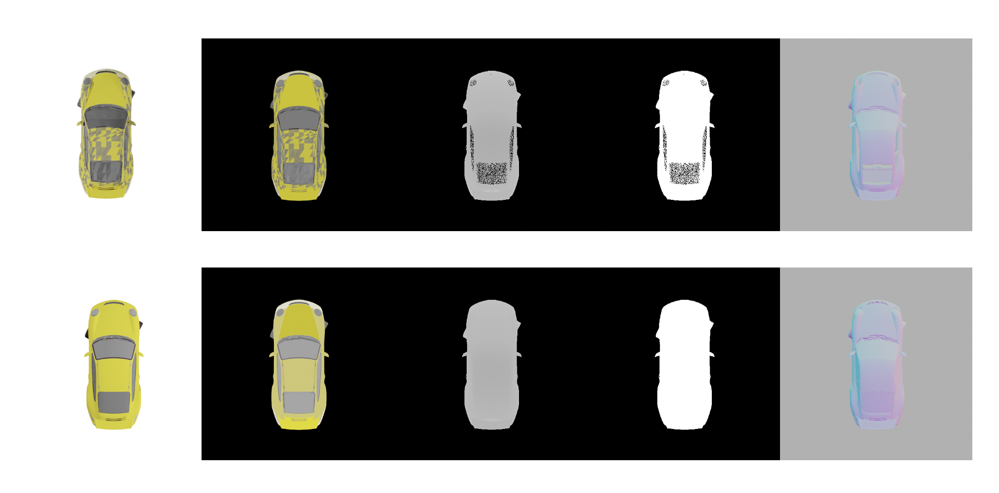

# shapenet_render

Blender render for shapenet v2, test in blender 2.83 and shapenet v2. Support render albedo, normal, depth, rgb with .png and .exr format.
- to prevent artifacts, recommed use .glb with EEVEE engine instead of .obj with CYCLE engine.
Outputs with artifacts, see https://github.com/panmari/stanford-shapenet-renderer/issues/20. The fist row is .glb with CYCYLES engine, the second row is .glb with EEVEE engine.
